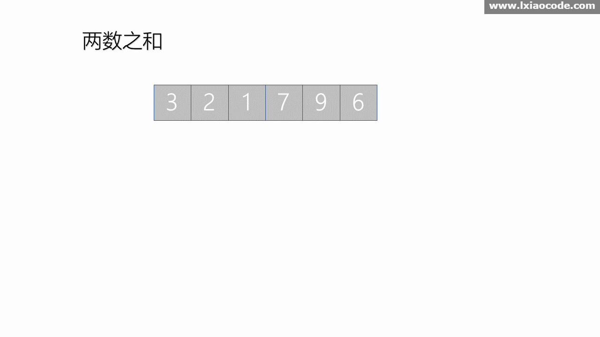

# [1. 两数之和](https://leetcode-cn.com/problems/two-sum/)

## 解法一：暴力法

时间复杂度： $O(n^2)$

```javascript
/**
 * @param {number[]} nums
 * @param {number} target
 * @return {number[]}
 */
var twoSum = function (nums, target) {
  let len = nums.length
  for (let i = 0; i < len - 1; i++) {
    for (let j = i + 1; j < len; j++) {
      if (nums[i] + nums[j] === target) {
        return [i, j]
      }
    }
  }
  return []
}
```


### 解题思路

两次循环依次获取数组的值，然后判断是否等于预期的值。

## 解法二：哈希表

时间复杂度：$O(n)$

```javascript
/**
 * @param {number[]} nums
 * @param {number} target
 * @return {number[]}
 */
var twoSum = function (nums, target) {
  let map = new Map()
  for (let i = 0; i < nums.length; i++) {
    if (map.has(target - nums[i])) {
      return [map.get(target - nums[i]), i]
    } else {
      map.set(nums[i], i)
    }
  }
  return []
}
```

### 解题思路

- for循环遍历每一个元素，在map中查找与该元素符合条件的元素（target  -nums[i]）。
- 如果 map 中没有符合条件的元素，则将该元素放入map中。
- 为下一个元素寻找符合条件的元素。


