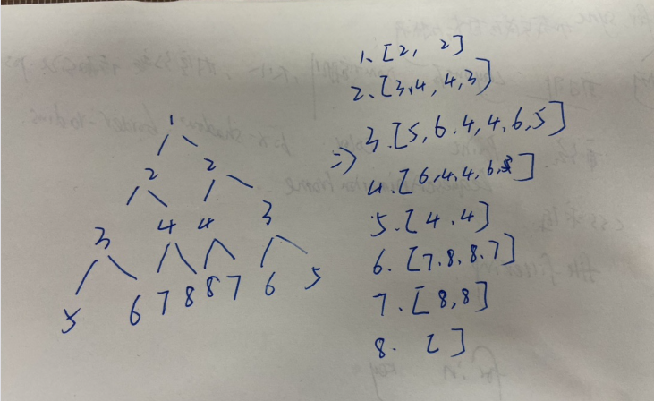

# [对称二叉树](https://leetcode-cn.com/problems/symmetric-tree/description/)

## 解法一：递归

时间复杂度：$O(n)$

```javascript
/**
 * @param {TreeNode} root
 * @return {boolean}
 */
var isSymmetric = function (root) {
  function check(p, q) {
    if (p === null && q === null) {
      return true
    }
    if (p === null || q === null) {
      return false
    }
    if (p.val !== q.val) {
      return false
    }
    return check(p.left, q.right) && check(p.right, q.left)
  }
  return check(root, root)
}
```

### 解题思路

如果一个树的左子树和右子树镜像对称，那么就说明该树是对称的。


所以问题可以转化为： **两个树在什么情况下互为镜像**

如果同时满足下面的条件，两个树互为镜像：

- 它们的两个根结点具有相同的值
- 每个树的右子树都与另一个树的左子树镜像对称


我们可以实现这样一个递归函数，通过「同步移动」两个指针的方法来遍历这棵树，p 指针和 q 指针一开始都指向这棵树的根，随后 p 右移时，q 左移，p 左移时，q 右移。每次检查当前 p 和 q 节点的值是否相等，如果相等再判断左右子树是否对称。


最后一步 `check(root, root)` 不太好理解，其意思大概是自己和自己比较看自己是不是互为自己的镜像二叉树。

改为下面代码更好理解一点，比较 root 的左右子树是否互为镜像二叉树。

```javascript
if (!root)return true
return check(root.left ,root.right)
```


## 解法二：迭代

时间复杂度： $O(n)$

```javascript
/**
 * @param {TreeNode} root
 * @return {boolean}
 */
var isSymmetric = function (root) {
  if (root === null) {
    return true
  }
  if (!(root.left === null && root.right === null) && (root.left === null || root.right === null)) {
    return false
  }
  let arr = []
  arr.unshift(root.left)
  arr.push(root.right)
  while (arr.length) {
    let right = arr.pop()
    let left = arr.shift()
    if (left === null && right === null) {
      continue
    }
    if (left === null || right === null) {
      return false
    }
    if (right.val !== left.val) {
      return false
    }
    arr.unshift(left.right)
    arr.unshift(left.left)
    arr.push(right.left)
    arr.push(right.right)
  }
  return true
}
```


### 解题思路


大致流程跟上图类似

维护一个队列，首先将 root 的左右子树分别放到队列的最前面和最后面。

首先从队列中拿出队首和队尾的两个节点(left 和 right)比较

将 left 的 left 节点和 left 的 right 节点放入队首

将 right 的 right 节点和 right 的 left 节点放入队位

之后每次就是取队首队尾比较。


举个栗子:



