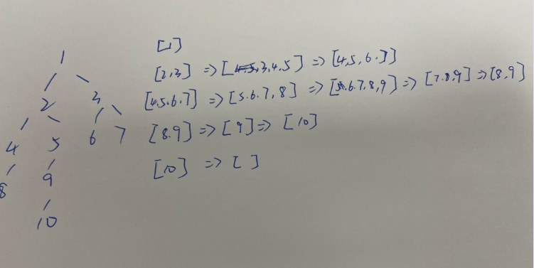

# [二叉树的最大深度](https://leetcode-cn.com/problems/maximum-depth-of-binary-tree/description/)

## 解法一：笨方法

时间复杂度：$O(n)$

```javascript
/**
 * @param {TreeNode} root
 * @return {number}
 */
var maxDepth = function (root) {
  let max = 0
  function visit(tree, depth) {
    max = Math.max(max, depth)
    if (!tree) {
      return
    }
    tree.left && visit(tree.left, depth + 1)
    tree.right && visit(tree.right, depth + 1)
  }
  root && visit(root, 1)
  return max
}
```

### 解题思路

维护了最大值

在深度遍历的递归函数中增加一个 depth 值，用来跟 max比较，以得到最大值。


## 解法二：递归

时间复杂度：$O(n)$

```javascript
/**
 * @param {TreeNode} root
 * @return {number}
 */
var maxDepth = function (root) {
  if (!root) {
    return 0
  }
  return Math.max(maxDepth(root.left), maxDepth(root.right)) + 1
}
```

### 解题思路

如果我们知道了左子树和右子树的最大深度 l 和 r，那么该二叉树的最大深度即为$max(l, r) + 1$

而左子树和右子树的最大深度又可以以同样的方式进行计算。因此我们在计算当前二叉树的最大深度时，可以先递归计算出其左子树和右子树的最大深度，然后在 $O(1)$ 时间内计算出当前二叉树的最大深度。递归在访问到空节点时退出。


## 解法三：广度优先遍历


```javascript
/**
 * @param {TreeNode} root
 * @return {number}
 */
var maxDepth = function (root) {
  if (!root) {
    return 0
  }
  let queue = []
  queue.unshift(root)
  let ans = 0
  while (queue.length) {
    let size = queue.length
    while (size) {
      let node = queue.shift()
      node.left && queue.push(node.left)
      node.right && queue.push(node.right)
      size--
    }
    ans++
  }
  return ans
}
```


### 解题思路

我们也可以用「广度优先搜索」的方法来解决这道题目，但我们需要对其进行一些修改，此时我们广度优先搜索的队列里存放的是**当前层的所有节点**。

每次拓展下一层的时候，不同于广度优先搜索的每次只从队列里拿出一个节点，我们需要将队列里的所有节点都拿出来进行拓展，这样能保证每次拓展完的时候队列里存放的是当前层的所有节点，即我们是一层一层地进行拓展，最后我们用一个变量 ans 来维护拓展的次数，该二叉树的最大深度即为 ans。

举个栗子

