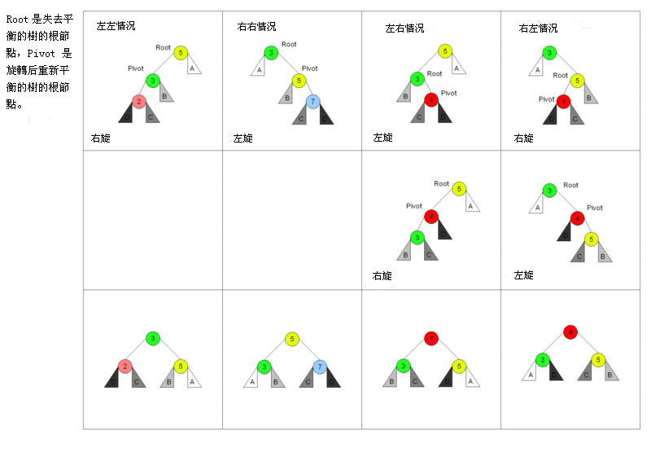

# [将有序数组转换为二叉搜索树](https://leetcode-cn.com/problems/convert-sorted-array-to-binary-search-tree/description/)

## 解法一：二分 +递归（深度优先遍历）

时间复杂度：$O(n)$

```javascript
/**
 * @param {number[]} nums
 * @return {TreeNode}
 */
var sortedArrayToBST = function (nums) {
  function dfs(nums, left, right) {
    if (left > right) {
      return null
    }
    let mid = Math.floor((left + right) / 2)
    let node = new TreeNode(nums[mid])
    node.left = dfs(nums, left, mid - 1)
    node.right = dfs(nums, mid + 1, right)
    return node
  }
  return dfs(nums, 0, nums.length - 1)
}
```


### 解题思路

高度平衡二叉树是指一个二叉树*每个节点* 的左右两个子树的高度差的绝对值不超过 1。

也就是业界常说的 AVL 树。

AVL 树的重点知识在于他的旋转。




这里是有序数组构建 AVL 树。

所以我们很容易想到使用 二分法，每次取中间的值作为根节点，按照先序 根-左-右的顺序来创建这个AVL 树。

