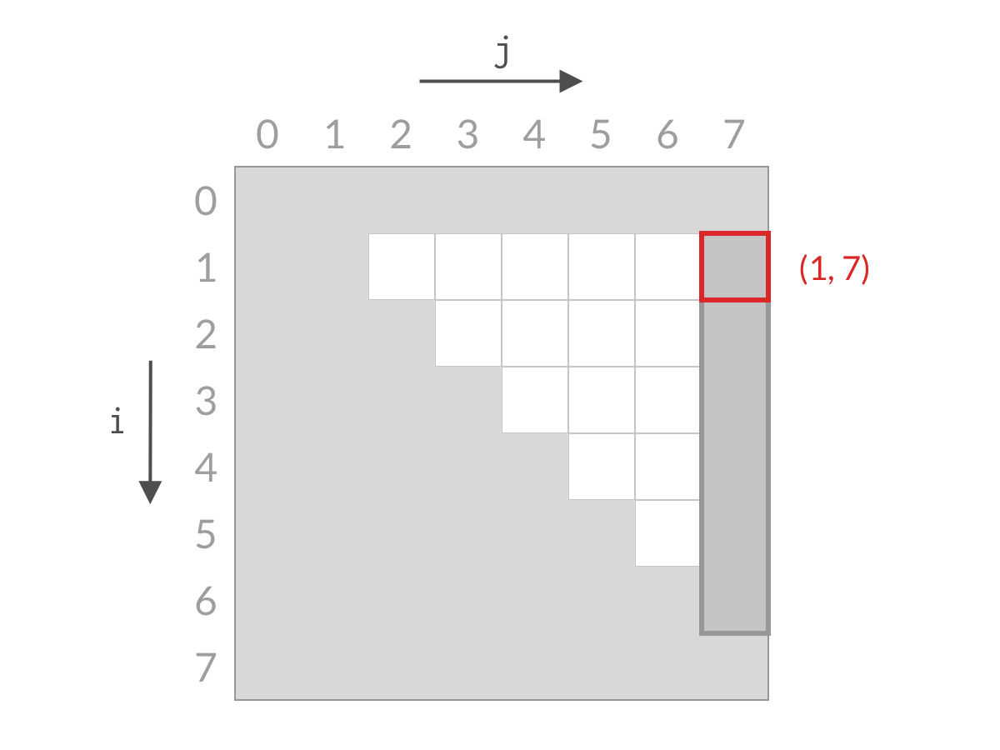

# [11] [盛最多水的容器](https://leetcode-cn.com/problems/container-with-most-water/)

## 题解一：双指针，两数夹壁

时间复杂度：`O(n)`

```javascript
/**
 * @param {number[]} height
 * @return {number}
 */
var maxArea = function (height) {
  let max = 0
  let len = height.length
  for (let i = 0, j = len - 1; i < j; ) {
    max = Math.max(max, (j - i) * Math.min(height[j], height[i]))
    height[i] > height[j] ? j-- : i++
  }
  return max
}
```

在掌握双指针解法的同事，也要理解其背后 **缩减搜索空间** 的思想。

双指针解法的要点是： **指针每一次移动，都意味着排除掉了一个柱子**。

### 解题思路


上图为例

- 首先考虑相聚最远的两个柱子所能容纳的面积， 宽度是两个柱子之间的距离 8，高度是两个柱子中较短的一个，所以是 3* 7 = 24
- 当前选择的两个柱子是最两侧的柱子，所以宽度已经是最大，其他组合的宽度都会小于这个值
- 由于高度是取决于两个柱子中较短的一个，所以如果移动右侧的柱子，那么不管怎么移动，高度始终不会高于左侧柱子的高度
- 如果移动左侧的柱子，不管怎么移动，高度始终不会高于右侧柱子的高度
- 由此可见，如果固定左侧柱子，移动右侧柱子，高度一定不会增加，且宽度一定会减少。所以这时候左边柱子和其他任意一个柱子的组合，都可以被排除了。这就是代码里的 `i++`。
- 上面是由于左侧柱子的高度低于右侧柱子的高度，反之，则会固定左侧柱子，移动右侧柱子。这就是代码里的 `j++`
- 随着不断的排除，`i` 和 `j` 都会往中间移动，当 `i` 和 `j` 相遇时，算法就结束了

### 原理分析

假设共有 n 个柱子。我们需要寻找的两个柱子条是 `i` 和 `j`，约束条件是：

- `i` `j` 都是合法柱子下标，即 `0 <= i < n, 0 < j <n`
- `i` 始终在 `j` 的左边，即 `i < j`

以 `n=8`为例，全部搜索空间为：


搜索空间是白色的倒三角部分，可以看到搜索空间为 `O(n^2)`，所以这就是暴力求解的时间复杂度。

一开始，检查右上角的 (0, 7) 单元格，即最左侧的 0 号柱子和最右侧的 7 号柱子，计算他们的面积。

然后我们对比一下两个柱子的高度，关注其中较短的一根。

假设左侧的 0 号柱子较短，按照上文的结论，7 号柱子已经是距离它最远的柱子，所以宽度已经最大了，如果换其他柱子跟 0 号柱子组合，其宽度势必会变小，高度也不会增加，所以面积势必是变小的。于是，在记录了(0, 7) 组合的面积之后， 就可以把 0号柱子与其他柱子的组合都排除掉，也就是下图。用代码描述是 `i++`，在搜索空间里，即削减了一行。


同理，检查右上角的 (1, 7) ，考虑 1 号柱子和 7 号柱子，计算面积，然后比较两根柱子的高度。

假设这时候 7 号柱子较短。同理 1号柱子已经是 7号柱子最远的组合了。所以排除掉 2、3、4 等号柱子与 7 号柱子的组合。在记录  (1, 7) 组合的结果之后，就可以把 7号柱子与其他柱子的组合都排除掉，也就是下图。用代码描述是 `j--`，对应搜索空间里，是削减了一列。



可以看到，无论是柱子 i 和 j 哪根较短，我们都可以排除掉一行或一列的搜索空间，经过 n 步之后，就能排除掉所有的搜索空间，检查完所有的可能性。即下面动图：


## 题解二：暴力解法

时间复杂度： `O(n^2)`

```javascript
/**
 * @param {number[]} height
 * @return {number}
 */
var maxArea = function (height) {
  let max = 0
  let len = height.length
  for (let i = 0; i < len - 1; i++) {
    for (let j = i + 1; j < len; j++) {
      max = Math.max(max, (j - i) * Math.min(height[i], height[j]))
    }
  }
  return max
}
```

