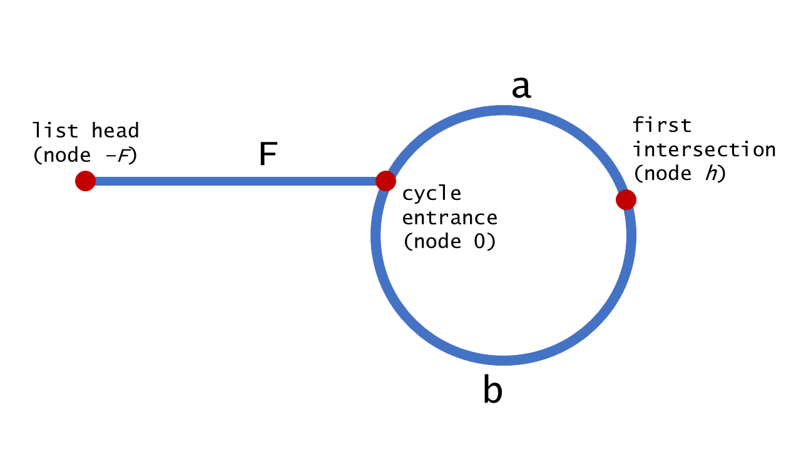

#### [142. 环形链表 II](https://leetcode-cn.com/problems/linked-list-cycle-ii/)

## 解法一：双指针

时间复杂度： $O(n)$

```javascript
/**
 * @param {ListNode} head
 * @return {ListNode}
 */
var detectCycle = function (head) {
  if (head === null || head.next === null || head.next.next === null) {
    return null
  }
  let start = head
  let slow = head.next
  let fast = head.next.next
  while (fast.next !== null && fast.next.next !== null) {
    if (fast === slow) {
      while (start !== slow) {
        start = start.next
        slow = slow.next
      }
      return start
    }
    fast = fast.next.next
    slow = slow.next
  }
  return null
}
```

### 解题思路

这个题目跟前面的环形链表类似，但是这里需要有一个证明，就是为什么初始位置到入环位置的距离等于快慢指针交点位置到入环位置的距离呢。



下面的分析可能会比较绕一定要自己写写画画才能明白的。

我们有以下已知条件：

- 快指针每次走两步，慢指针每次走一步
- head 到环的入口是 F
- 快慢指针交于 h 点，环入口到 h 点的距离是 a，h 点到环入口的距离是 b

由以上，我们假设快指针绕环走了 n 圈，慢指针绕环走了 m 圈， 所以得

$a(F + m(a+b) + a) = F + n(a + b) + a$

得  $F + a = (n - 2m) (a+b)$

得 $F = (n - 2m - 1)(a + b) + b$

上面公式表示。 F 的距离是 $n-2m-1$ 倍的环长 加上 b 的长度

所以这里的两个指针，从起点开始的指针和从快慢指针相交点的指针，同步移动的情况下，他们最终会在 交点 指针绕了 $n-2m-1$ 圈后，在入环的位置相遇。


## 解法二：借助哈希表

时间复杂度： $O(n)$

```javascript
/**
 * @param {ListNode} head
 * @return {ListNode}
 */
var detectCycle = function (head) {
  let hashMap = new Map()
  while (head) {
    if (hashMap.has(head)) {
      return head
    }
    hashMap.set(head, true)
    head = head.next
  }
  return null
}
```

### 解题思路

同上一个栗子

只不过这里的返回结果是当前节点或者是 `null`。


