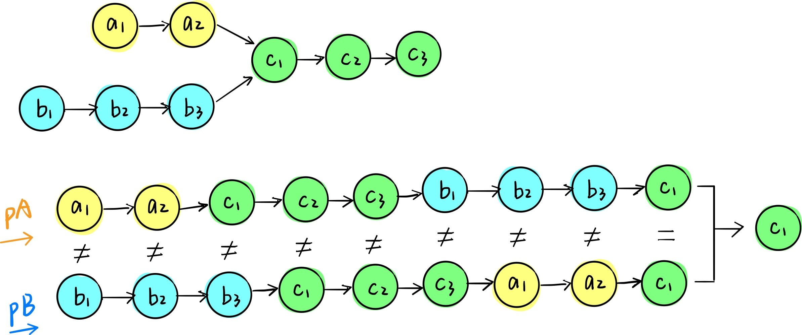

# [相交链表](https://leetcode-cn.com/problems/intersection-of-two-linked-lists/description/)

## 解法一：

时间复杂度：$O(n^2)$

```javascript
/**
 * @param {ListNode} headA
 * @param {ListNode} headB
 * @return {ListNode}
 */
var getIntersectionNode = function (headA, headB) {
  let pA = headA
  while (pA) {
    let pB = headB
    while (pB) {
      if (pB === pA) {
        return pA
      }
      pB = pB.next
    }
    pA = pA.next
  }
}
```

### 解题思路

两层循环。外层循环 A 中的节点，内存循环 B 的节点。然后判断两个节点是否相等。


## 解法二：双指针

时间复杂度：$O(n)$


```javascript
/**
 * @param {ListNode} headA
 * @param {ListNode} headB
 * @return {ListNode}
 */
var getIntersectionNode = function (headA, headB) {
  let pA = headA
  let pB = headB
  while (pA || pB) {
    if (pA === pB) return pA
    pA = pA === null ? headB : pA.next
    pB = pB === null ? headA : pB.next
  }
  return null
}
```

### 解题思路

跟前面的环形链表相似，双指针判断是否相等。




## 解法三：投机取巧

时间复杂度：$O(n)$

```javascript
/**
 * @param {ListNode} headA
 * @param {ListNode} headB
 * @return {ListNode}
 */
var getIntersectionNode = function (headA, headB) {
  let pA = headA
  let pB = headB
  while (pA) {
    pA.flag = true
    pA = pA.next
  }
  while (pB) {
    if (pB.flag) {
      return pB
    }
    pB = pB.next
  }
  return null
}
```

### 解题思路

先遍历`headA`并打上标记，再遍历`headB`寻找标记。

不推荐！！！有悖链表的思想。


注：这道题有个坑。如下图，很多同学会疑问为什么相交节点不是 `1` 呢。这里其实是比较当前节点的内存地址，所以不是 `pA.val === pB.val` 而是 `pA === pB`。

