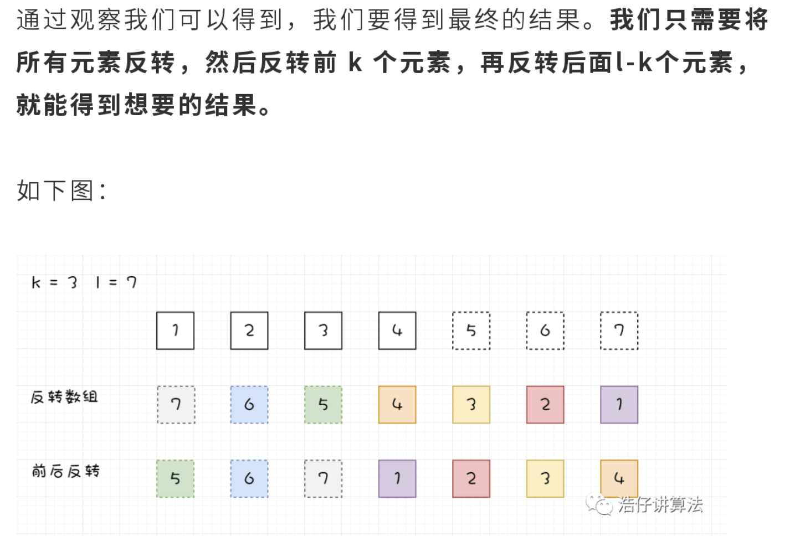

# [189. 旋转数组](https://leetcode-cn.com/problems/rotate-array/)

## 解法一：额外空间

时间复杂度：$O(n)$

```javascript
/**
 * @param {number[]} nums
 * @param {number} k
 * @return {void} Do not return anything, modify nums in-place instead.
 */
var rotate = function (nums, k) {
  k = k % nums.length
  let temp = nums.slice(-k).concat(nums.slice(0, -k))
  for (let i = 0; i < nums.length; i++) {
    nums[i] = temp[i]
  }
}
```

### 解题思路

- `Array.prototype.slice(x)` 会返回新数组，所以需要使用额外数组空间

- `Array.prototype.concat(x)` 合并两个数组，返回原数组


## 解法二：暴力法

时间复杂度：$O(n^2)$

```javascript
/**
 * @param {number[]} nums
 * @param {number} k
 * @return {void} Do not return anything, modify nums in-place instead.
 */
var rotate = function (nums, k) {
  for (let i = 0; i < k; i++) {
    let prev = nums[nums.length - 1]
    for (let j = 0; j < nums.length; j++) {
      let temp = nums[j]
      nums[j] = prev
      prev = temp
    }
  }
}
```

### 解题思路

每次移动一位，移动 k 步。


## 解法三：多次反转

时间复杂度：$O(n)$

```javascript
/**
 * @param {number[]} nums
 * @param {number} k
 * @return {void} Do not return anything, modify nums in-place instead.
 */
var rotate = function (nums, k) {
  function reserve(arr, start, end) {
    while (start < end) {
      let temp = arr[start]
      arr[start++] = arr[end]
      arr[end--] = temp
    }
  }
  let len = nums.length
  k = k % len
  reserve(nums, 0, len - 1)
  reserve(nums, 0, k - 1)
  reserve(nums, k, len - 1)
}
```

### 解题思路

这个写法建立在这么一个基础上：



## 解法四：利用 JavaScript 数组方法

时间复杂度：$O(1)$

```javascript
/**
 * @param {number[]} nums
 * @param {number} k
 * @return {void} Do not return anything, modify nums in-place instead.
 */
var rotate = function (nums, k) {
  let len = nums.length
  let _k = k % len
  nums.splice(0, 0, ...nums.splice(-_k))
}
```


### 解题思路

这里借助到 JavaScript 的数组方法

- `Array.prototype.splice(start[, deleteCount[, item1[, item2[, ...]]]])`：除了第一个参数其余都可以省略，返回结果被删除项组成的数组