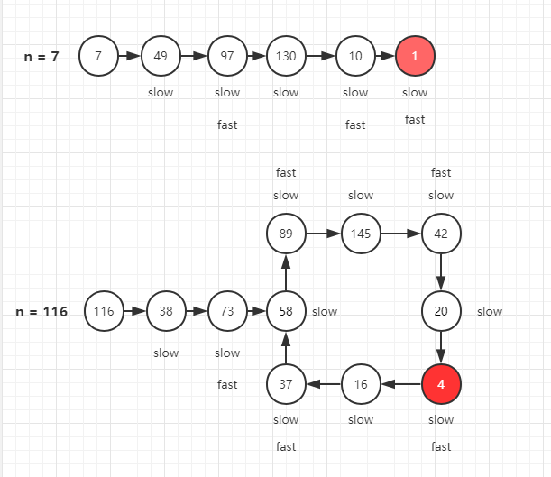

# [快乐数](https://leetcode-cn.com/problems/happy-number/description/)

## 解法一：哈希表

时间复杂度：$O(n)$

```javascript
/**
 * @param {number} n
 * @return {boolean}
 */
var isHappy = function (n) {
  if (n === 1) {
    return true
  }
  const list = new Set()
  while (!list.has(n)) {
    list.add(n)
    let sum = 0
    while (n) {
      const value = n % 10
      sum += Math.pow(value, 2)
      n = Math.floor(n / 10)
    }
    if (sum === 1) {
      return true
    }
    n = sum
  }
  return false
}
```


### 解题思路 

用一个 Set 集合来存储过程中产生的值

若在不满足1的情况下，出现 Set 存在的元素，说明进入了循环，可以结束代码，返回false


## 解法二：快慢指针

时间复杂度：$O(n)$

```javascript
/**
 * @param {number} n
 * @return {boolean}
 */
var isHappy = function (n) {
  let slow = sum(n)
  let fast = sum(slow)
  while (slow !== fast) {
    slow = sum(slow)
    fast = sum(sum(fast))
  }
  return slow === 1
  function sum(n) {
    n = n.toString()
    let sum = 0
    for (let i of n) {
      sum += Math.pow(i, 2)
    }
    return sum
  }
}
```


### 解题思路

是慢的 只做一次平方求和, 快的做两次, 显然 快的 比 慢的 快,

如果 (死循环 或者 最终等于1) 的话 fast 肯定会 和 slow 碰上

等于1后 fast会一直等于1, 因为 1的平方 等于1, 之后就坐等slow追上了

死循环, 跑圈, slow 最终会碰上 fast

只要判断碰上时是不是等于 1 

