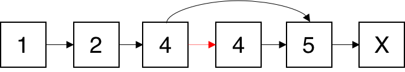

# [删除链表中的节点](https://leetcode-cn.com/problems/delete-node-in-a-linked-list/description/)

## 解法一：

时间复杂度：$O(1)$

```javascript
/**
 * Definition for singly-linked list.
 * function ListNode(val) {
 *     this.val = val;
 *     this.next = null;
 * }
 */
/**
 * @param {ListNode} node
 * @return {void} Do not return anything, modify node in-place instead.
 */
var deleteNode = function (node) {
  node.val = node.next.val
  node.next = node.next.next
}
```

### 解题思路





