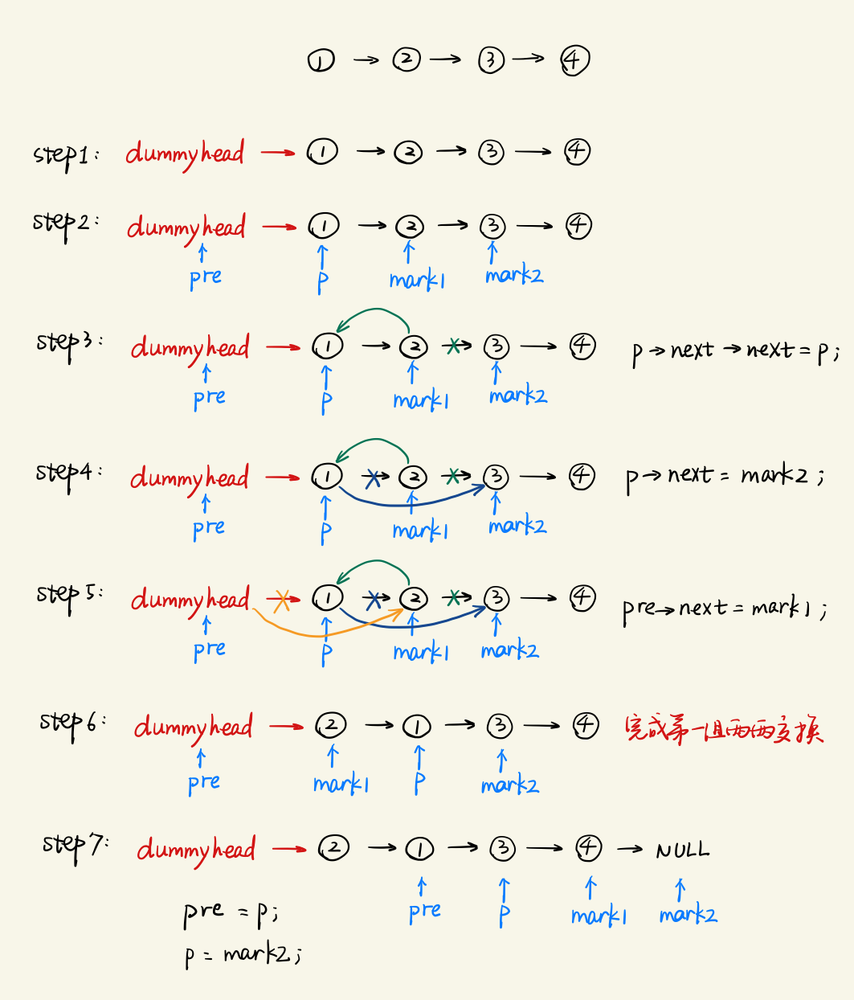
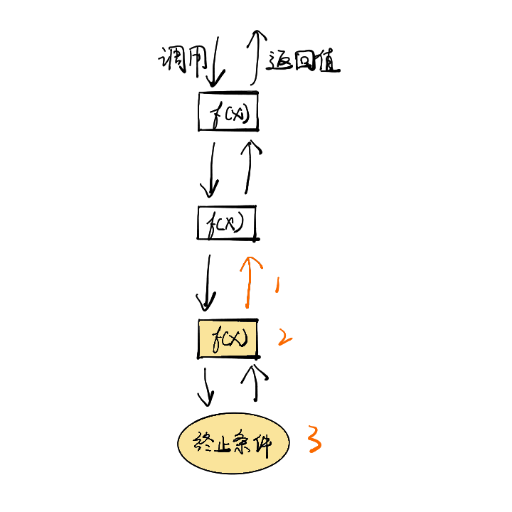
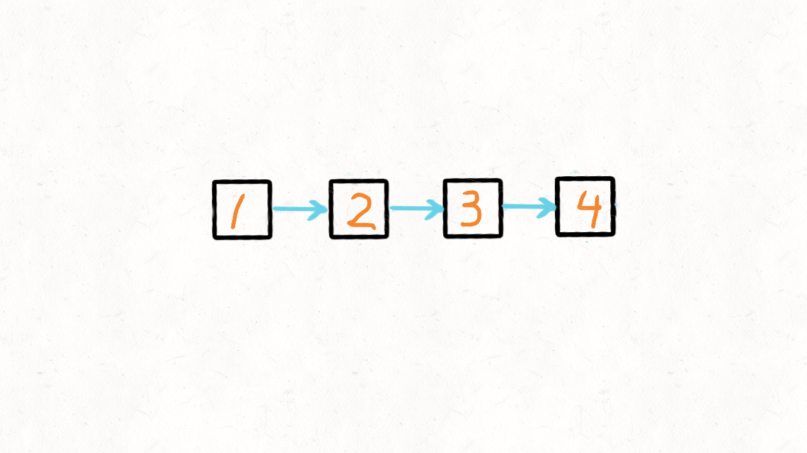

#### [24. 两两交换链表中的节点](https://leetcode-cn.com/problems/swap-nodes-in-pairs/)

## 解法一：加哨兵 + 迭代

时间复杂度：$O(n)$

```typescript
function swapPairs(head: ListNode | null): ListNode | null {
  let sentry: ListNode = new ListNode(0)
  sentry.next = head

  let prev = sentry
  while (head && head.next) {
    let n1 = head
    let n2 = head.next

    prev.next = n2
    n1.next = n2.next
    n2.next = n1

    prev = n1
    head = prev.next
  }
  return sentry.next
}
```


### 解题思路

对于链表的题目来说，要有一种加哨兵的想法。




## 解法二：递归

时间复杂度：$O(n)$

```typescript
function swapPairs(head: ListNode | null): ListNode | null {
  if (!head || !head.next) {
    return head
  }
  let n = head.next
  head.next = swapPairs(n.next)
  n.next = head
  return n
}
```


### 解题思路

递归写法要观察本地递归的解决过程，形成抽象模型

递归本质就是不断重复相同的事情，而不是思考完整的调用栈

如题，我们需要关注的是一级调用单元的全过程，即单个 $f(x)$



其中我们需要关心三点：

1. 返回结果
2. 调用单元做了什么
3. 终止条件

对于本题而言：

1. 返回结果：交换完的子链表（从后往前的完成顺序）
2. 调用单元：需要交换的两个点为 head 和 n， head 的 next 连接后面完成交换的子链表，n 的 next 连接 head，完成交换
3. 终止条件：head 为空或者 head 的 next 为空，也就是当前无节点或当前节点没有后置节点（即当前是个奇数链表），无法交换

下面图里的 t 就是我们的 n。

