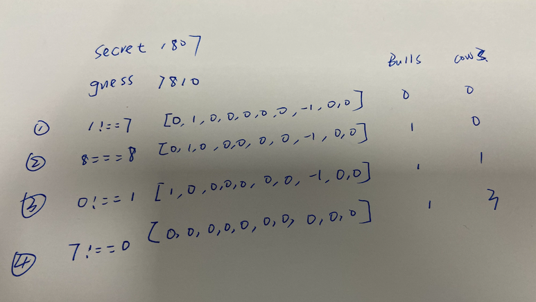

# [猜数字游戏](https://leetcode-cn.com/problems/bulls-and-cows/description/)

## 解法一：哈希表

时间复杂度：$O(n)$

```javascript
/**
 * @param {string} secret
 * @param {string} guess
 * @return {string}
 */
var getHint = function (secret, guess) {
  let nums = Array(10).fill(0)
  let Bulls = 0
  let Cows = 0
  for (let i = 0; i < secret.length; i++) {
    if (secret[i] === guess[i]) {
      Bulls++
    } else {
      if (nums[secret[i]]++ < 0) Cows++
      if (nums[guess[i]]-- > 0) Cows++
    }
  }
  return `${Bulls}A${Cows}B`
}
```

### 解题思路

`nums = Array(10).fill(0)` 这一句是存储出现数字的个数(数字为下标, 个数为值)，10个数字所以是数组的长度是 10。

循环每次判断是否相等就可以得出公牛的数目。

而母牛的数目，这里使用的是遇到 secret 中的值就 + 1，判断是否小于 0 决定 母牛是否增加，遇到 guess 中的值就 - 1，判断是否大于 0 决定母牛是否增加。

举个栗子 1807 和7810



