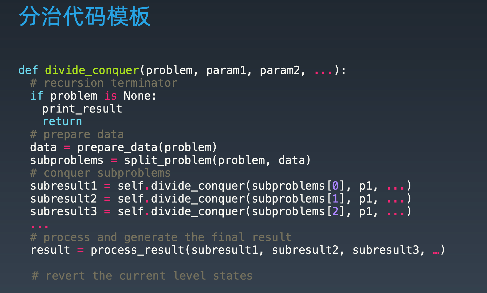

# [Pow(x, n)](https://leetcode-cn.com/problems/powx-n/description/)

## 解法一：暴力法

时间复杂度：$O(N)$

```typescript

```


### 解法二：分治

时间复杂度：$O(logN)$

```typescript
function myPow(x: number, n: number): number {
  let recursion = function (result: number, n: number) {
    // 1.recursion terminator
    if (n === 0) {
      return 1
    }
    // 2. current process logic
    // 3.
    let subResult = recursion(x, Math.floor(n / 2))

    // 4. merge
    if (n % 2 === 1) {
      result = subResult * subResult * x
    } else {
      result = subResult * subResult
    }
    return result
    // 5. reverse states
  }
  if (n < 0) {
    x = 1 / x
    n = -n
  }
  return recursion(x, n)
}
```

### 解题思路

递归 Recursion

- 递归 - 循环

- 通过函数体来进行的循环


分治是




代入到这个道题中

```typescript
// 1.recursion terminator
// 分治的退出条件
if (n === 0) {
  return 1
}
// 2. current process logic
// 每次分治的逻辑
// 3. drill down
// 下探一层
let subResult = recursion(x, Math.floor(n / 2))

// 4.merge
// 合并
if (n % 2 === 1) {
  result = subResult * subResult * x
} else {
  result = subResult * subResult
}
return result
// 5. reverse states
```