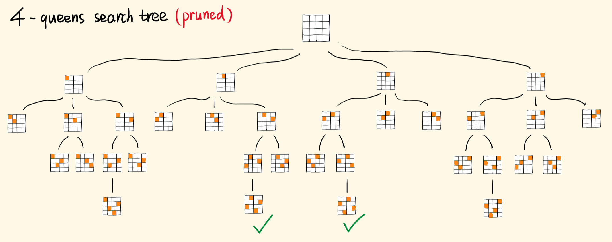

# [N 皇后](https://leetcode-cn.com/problems/n-queens/description/)

## 解法一：回溯


```typescript
function solveNQueens(n: number): string[][] {
  let result: number[][] = []
  let cols: Set<number> = new Set()
  let pies: Set<number> = new Set()
  let nas: Set<number> = new Set()

  function recursion(row: number, list: number[]) {
    // terminator
    if (row === n) {
      result.push(list)
      return
    }
    // process
    for (let col = 0; col < n; col++) {
      if (cols.has(col) || pies.has(row + col) || nas.has(row - col)) {
        continue
      }

      cols.add(col)
      pies.add(row + col)
      nas.add(row - col)
      // drill down
      recursion(row + 1, [...list, col])

      // reverse
      cols.delete(col)
      pies.delete(row + col)
      nas.delete(row - col)
    }
  }

  recursion(0, [])
  function genStr(nums: Array<Array<number>>, n: number): Array<Array<string>> {
    return nums.map(list => list.map(i => '.'.repeat(i) + 'Q' + '.'.repeat(n - i - 1)))
  }
  return genStr(result, n)
}
```


### 解题思路



其中有几个问题

1. 每一行只能有一个皇后，所以可以用一个长度为 n 的数组来表述一个解，其中每个数字表示当前行中皇后在第几列
2. 撇是 当前行与列之和一致的结果，捺是当前行与列之差一致的结果
3. 需要记得在 recursion 结束时，清除上一次的列、撇、捺数据。

