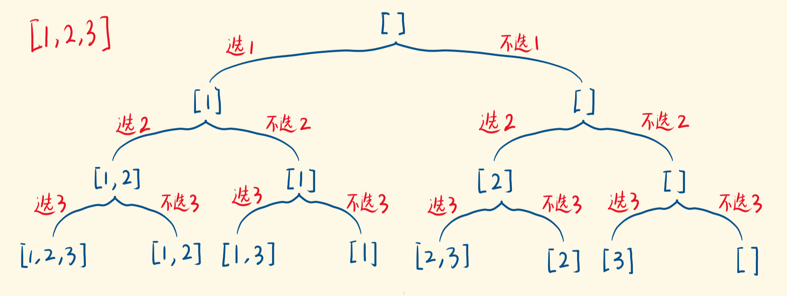

# [子集](https://leetcode-cn.com/problems/subsets/description/)

## 解法一：回溯

时间复杂度：$O(N^2)$

```typescript
function subsets(nums: number[]): number[][] {
  let result: number[][] = []
  let recursion = function (list: number[], index: number) {
    // terminator
    if (index === nums.length) {
      result.push(list.concat())
      return
    }

    // process logic
    // not pick
    recursion(list, index + 1)
    // pick
    list.push(nums[index])
    recursion(list, index + 1)
    // drill down

    // merge
    // reverse state
    list.pop()
  }
  recursion([], 0)
  return result
}
```


### 解题思路




## 解法二：迭代法

时间复杂度：$O(N^2)$

```typescript
function subsets(nums: number[]): number[][] {
  let result: number[][] = [[]]
  for (let i = 0; i < nums.length; i++) {
    let len = result.length
    for (let j = 0; j < len; j++) {
      let temp = [...result[j]]
      temp.push(nums[i])
      result.push(temp)
    }
  }
  return result
}
```


### 解题思路

在最后的结果数组里创建一个空数组，然后每次遍历，都给结果数组中的每一个数组添加新数并推进数组中。