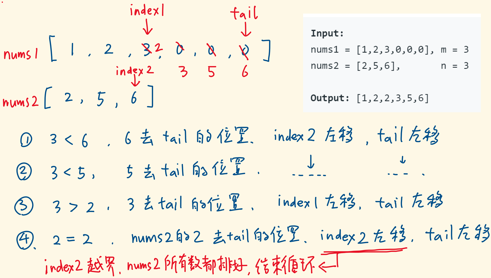

# [88. 合并两个有序数组](https://leetcode-cn.com/problems/merge-sorted-array/)

## 解法一：双指针/从前往后

时间复杂度：$O(n)$ （这里的 n 只是虚指，并不是参数里的 n，如果考究的话，时间复杂度应该是 $O(m+n)$）

```javascript
/**
 * @param {number[]} nums1
 * @param {number} m
 * @param {number[]} nums2
 * @param {number} n
 * @return {void} Do not return anything, modify nums1 in-place instead.
 */
var merge = function (nums1, m, nums2, n) {
  let i = 0
  let j = 0
  let temp = nums1.slice(0, m)
  while (i < m && j < n) {
    nums1[i + j] = temp[i] < nums2[j] ? temp[i++] : nums2[j++]
  }
  while (i < m) {
    nums1[i + j] = temp[i++]
  }
  while (j < n) {
    nums1[i + j] = nums2[j++]
  }
}
```

### 解题思路

这里需要构造出来一个 nums1 前 m 个数的副本以方便我们比较操作之后，操作 nums1。

循环的退出条件是当 i >= m 或 j >= n，即其中一个数组已经迭代完毕。

剩下的工作就是迭代另一个数组剩下的部分。


## 解法二：双指针/从后往前

时间复杂度： $O(n)$

```javascript
/**
 * @param {number[]} nums1
 * @param {number} m
 * @param {number[]} nums2
 * @param {number} n
 * @return {void} Do not return anything, modify nums1 in-place instead.
 */
var merge = function (nums1, m, nums2, n) {
  let index1 = m - 1
  let index2 = n - 1
  let index = m + n - 1
  while (index1 >= 0 && index2 >= 0) {
    nums1[index--] = nums1[index1] > nums2[index2] ? nums1[index1--] : nums2[index2--]
  }
  nums1.splice(0, index2 + 1, ...nums2.slice(0, index2 + 1))
}
```

### 解题思路

从后往前迭代也是可以。依次迭代添加。

这里需要注意的是最后一步

`nums1.splice(0, len2 + 1, ...nums2.slice(0, len2 + 1))`

为什么需要把数组2 剩余的部分添加到数组1里面呢？

这里做几个假设

- 数组1 是 [4,5,6,0,0,0]， 数组2 是 [1,2,3]
  - 可以想象得到，当退出迭代的时候数组1为 [4,5,6,4,5,6]，也就是说数组2 中最大元素比数组1 中最小元素还要小。
  - 所以我们需要把数组2 剩下的部分（也就是整个数组2）拷贝到数组1 中的开始位置
  - 由于数组 splice 和 slice 函数的作用范围都是前闭后开，所以需要 +1 操作
- 数组1 是 [1,2,3,0,0,0]，数组2 是 [4,5,6]
  - 当退出迭代的时候数组1为 [1,2,3,4,5,6]，也就是说数组1 中最大元素比数组2 中最小元素还要小，所以这时候已经是排好序的了
  - 这时候 len2 的值是 -1
  - 所以执行 `nums1.splice(0, 0, ...nums2.slice(0, 0))` 是没有任何变化的
- 数组1 是 [2,2,3,0,0,0]，数组2 是[1,1,4]
  - 当退出迭代的时候数组1为 [2,2,2,2,3,4]，此时数组2 中还剩余[1,1]
  - 所以这时候将数组2 的元素添加到数组1 的开始的位置，即可完成排序。


## 解法三：


```javascript
/**
 * @param {number[]} nums1
 * @param {number} m
 * @param {number[]} nums2
 * @param {number} n
 * @return {void} Do not return anything, modify nums1 in-place instead.
 */
var merge = function (nums1, m, nums2, n) {
  let index1 = m - 1
  let index2 = n - 1
  let tail = m + n - 1
  while (index2 >= 0) {
    if (nums1[index1] > nums2[index2]) {
      nums1[tail] = nums1[index1]
      index1--
      tail--
    } else {
      nums1[tail] = nums2[index2]
      index2--
      tail--
    }
  }
}
```


### 解题思路



说实话，这个代码是我抄的

当我看到这个代码的时候，我断定一定会出问题的。

nums1 = [5,6,0,0,0] m = 2

nums2 = [-2,-1,2] n=3

我判断当 index 等于 -1 的时候，nums[-1] 是会取数组的最后一项。但实际上 nums[-1] 不会像其他语言那样取最后一项，这里会得到 undefined。

然后 undefined 跟数字作比较的时候，会隐式转换为 NaN，NaN 与数字比较时始终会返回 false。

所以代码能 run 得通。

